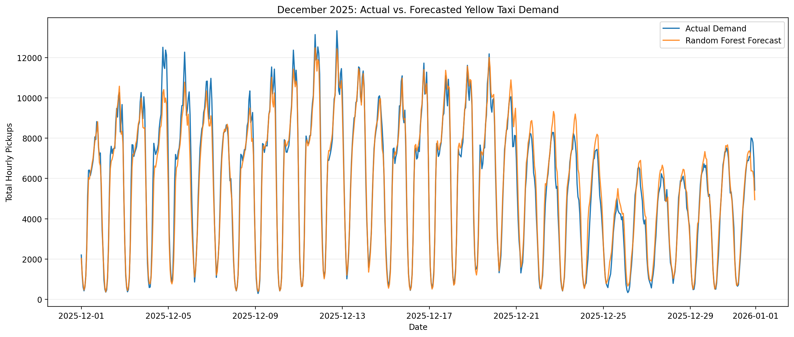
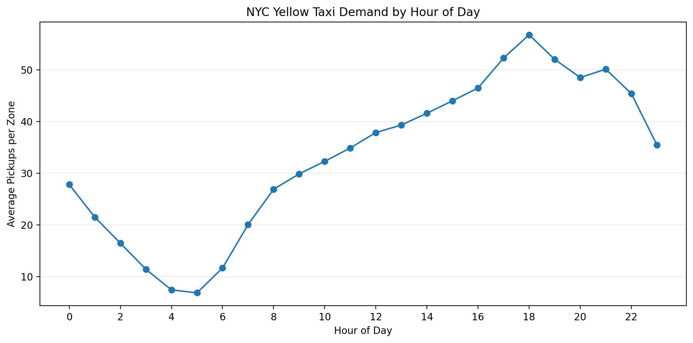
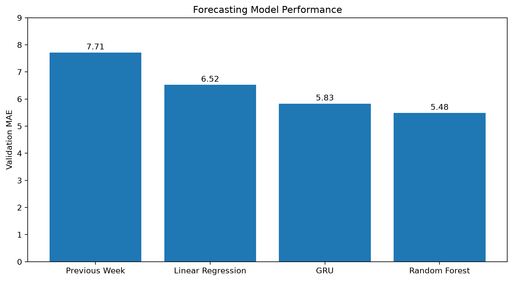
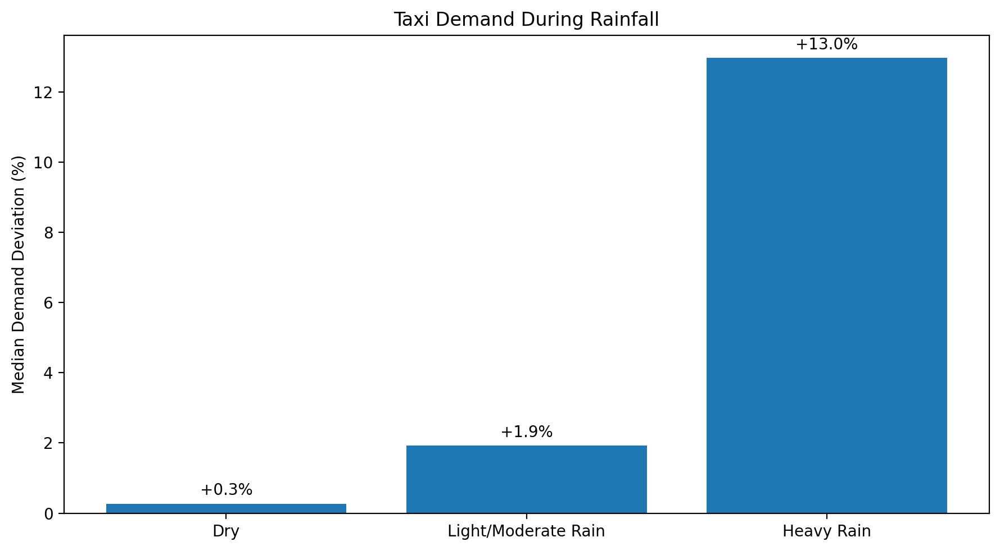

# NYC Taxi Demand Forecasting

A machine learning forecasting project using approximately **48 million 2025 NYC Yellow Taxi trips** to predict hourly pickup demand across New York City taxi zones.

The project builds an end-to-end time-series forecasting pipeline from raw TLC trip records through feature engineering, chronological model evaluation, external-factor analysis, and sequence-based deep learning. The final Random Forest reduced MAE by **49.8%** and RMSE by **55.8%** relative to a previous-week persistence baseline on held-out December 2025 data.

### Interactive Demo

[Launch the Interactive Streamlit App](https://nyc-taxi-demand-forecasting-gnkspgd2qzkzmdgwcj5crj.streamlit.app/)

## Project Overview

Taxi demand varies substantially across both location and time. Accurate short-term forecasts could help transportation platforms anticipate demand, allocate vehicles, and identify periods when historical patterns may be insufficient.

This project forecasts the number of Yellow Taxi pickups for each taxi zone one hour ahead using:

- Historical zone-level demand
- Calendar and holiday information
- Daily and weekly demand patterns
- Rolling demand statistics
- Weather conditions as an external-factor experiment
- Historical demand sequences through a GRU deep-learning experiment

The primary forecasting unit is **one pickup zone × one hour**.

## Key Results

- Processed approximately **48 million** Yellow Taxi trips from 12 monthly TLC datasets.
- Identified **174 consistently active pickup zones** representing **99.47% of all 2025 Yellow Taxi trips**.
- Constructed a balanced zone-hour panel containing more than **1.5 million observations**.
- Achieved a held-out December **MAE of 5.72** and **RMSE of 14.01** using Random Forest.
- Reduced MAE by **49.8%** and RMSE by **55.8%** relative to the previous-week persistence baseline.
- Found that heavy-rain hours had approximately **13% higher median demand**, but leakage-safe lagged weather worsened forecasting performance across all five backtest months.
- Evaluated a global GRU using 168-hour demand sequences and learned zone embeddings; it achieved **5.83 validation MAE** but did not outperform the Random Forest.

### Final Forecast



The final Random Forest closely tracked hourly demand throughout December while reducing MAE by **49.8%** relative to the previous-week persistence baseline.

## Data

Trip data comes from the NYC Taxi & Limousine Commission Yellow Taxi Trip Records for January through December 2025.

Rather than concatenating all raw trip records into memory, each monthly file was:

1. Loaded independently.
2. Restricted to pickup timestamps within the corresponding calendar month.
3. Aggregated to pickup-zone × hour demand.
4. Combined only after aggregation.

This reduced memory requirements while preserving the information required for forecasting.

### Zone Coverage

Not every TLC taxi zone receives consistent Yellow Taxi activity. Zones were evaluated based on the percentage of 2025 hours containing at least one pickup.

A **50% active-hour threshold** was selected before modeling.

This retained:

- **174 pickup zones**
- **99.47% of all observed Yellow Taxi trips**

A balanced hourly panel was then constructed so that zero-demand periods were represented explicitly rather than appearing as missing observations.

### Temporal Demand Patterns



Yellow Taxi demand followed a strong recurring intraday pattern, with the lowest demand during the early morning and substantially higher demand through the afternoon and evening. These recurring patterns motivated the use of hourly, daily, and weekly historical features.

## Feature Engineering

All demand-derived features were constructed independently within each pickup zone and ordered chronologically.

### Calendar Features

- Hour of day
- Day of week
- Month
- Day of month
- Weekend indicator
- Federal holiday indicator

### Historical Demand Features

- Demand 1 hour earlier (`lag_1`)
- Demand 24 hours earlier (`lag_24`)
- Demand 168 hours earlier (`lag_168`)
- Previous 24-hour rolling mean
- Previous 168-hour rolling mean

To prevent target leakage, rolling statistics were calculated only after shifting the demand series by one hour.

The first 168 hours for each zone were removed because the complete historical feature window was not yet available rather than imputing unavailable history.

## Model Development

Model development used chronological rather than random train/test splitting.

The original modeling period was divided into:

- **Training:** January 8 – September 30
- **Validation:** October 1 – November 30
- **Test:** December 1 – December 31

December remained untouched during the original model-comparison stage and was evaluated only after the Random Forest specification was selected.

### Naive Baselines

Three forecasting baselines were evaluated:

| Baseline | Validation MAE | Validation RMSE |
|---|---:|---:|
| Previous Hour | 8.76 | 22.08 |
| Previous Day | 10.24 | 29.56 |
| Previous Week | **7.71** | **20.89** |

The previous-week baseline performed best, demonstrating strong weekly recurrence in taxi demand.

### Machine Learning Models

| Model | Validation MAE | Validation RMSE |
|---|---:|---:|
| Previous Week Baseline | 7.71 | 20.89 |
| Linear Regression | 6.52 | 15.81 |
| Random Forest | **5.48** | 13.52 |
| HistGradientBoosting | 5.59 | **13.42** |

Linear Regression improved substantially over the naive baselines but produced more than 22,000 negative demand predictions.

HistGradientBoosting achieved slightly lower RMSE than Random Forest but had higher MAE and also produced negative predictions.

Because MAE was the primary evaluation metric, the **Random Forest** was selected.

### Model Comparison



The Random Forest achieved the lowest validation MAE. The GRU later demonstrated that a sequence-based neural network could learn meaningful temporal structure directly from historical demand, but it did not outperform the feature-engineered Random Forest.

### Final Test Performance

After model selection, the Random Forest was retrained on all January–November observations using the same hyperparameters and evaluated once on December.

| Model | December MAE | December RMSE |
|---|---:|---:|
| Previous Week Baseline | 11.40 | 31.72 |
| Random Forest | **5.72** | **14.01** |
| Improvement | **49.8%** | **55.8%** |

The final model produced no negative demand predictions.

## External Factor Analysis: Weather

Historical hourly weather observations were incorporated to investigate whether external conditions explain demand variation beyond recurring historical patterns.

The primary weather station was located in Manhattan. A 128-hour outage in March was identified during validation and supplemented using observations from LaGuardia Airport rather than interpolating across several days.

Daylight-saving transitions were also handled explicitly when aligning timezone-aware weather observations with timezone-naive TLC timestamps.

### Weather and Demand

Rainfall showed the clearest descriptive relationship with taxi demand.

After accounting descriptively for normal day-of-week and hour patterns:

| Conditions | Median Demand Deviation |
|---|---:|
| Dry | +0.27% |
| Light/Moderate Rain | +1.92% |
| Heavy Rain | **+12.97%** |



Demand increased with rainfall intensity after accounting for typical day-of-week and hour patterns. Heavy-rain hours showed approximately **13% higher median demand**, although only 54 heavy-rain hours were observed during the year. This relationship is descriptive rather than causal.

Temperature and wind showed weaker or less consistent patterns.

### Does Weather Improve Forecasting?

Observed weather at the target hour would not be known when making a one-hour-ahead forecast. Using it directly would therefore introduce unrealistic future information.

Instead, the forecasting experiment used weather observed one hour earlier.

A five-month expanding-window backtest compared identical Random Forest models with and without lagged weather features.

| Metric | Historical Model | + Lagged Weather |
|---|---:|---:|
| Average MAE | **5.35** | 5.38 |
| Average RMSE | **13.04** | 13.11 |

Weather improved MAE in **0 of 5 months** and worsened average MAE by approximately **0.54%**.

The historical-demand model was therefore retained.

This result highlights an important distinction between **explanation and prediction**: weather can have a meaningful relationship with taxi demand without providing additional predictive value once strong historical demand patterns are already represented.

## Deep Learning

A sequence-based deep learning model was evaluated to determine whether directly learning temporal patterns could improve upon the feature-engineered Random Forest.

A global **Gated Recurrent Unit (GRU)** network was trained across all 174 pickup zones. Each prediction used the previous **168 hours** of standardized demand, while a learned zone embedding allowed the network to represent location-specific characteristics.

Normalization statistics were calculated using training-period data only, and sequences were constructed independently within each zone to preserve the forecasting information boundary.

| Model | Validation MAE | Validation RMSE |
|---|---:|---:|
| Previous Week | 7.71 | 20.89 |
| Linear Regression | 6.52 | 15.81 |
| Random Forest | **5.48** | **13.52** |
| GRU | 5.83 | 14.01 |

The GRU substantially outperformed the naive baseline and Linear Regression, demonstrating that meaningful temporal structure could be learned directly from historical sequences. However, it did not outperform the Random Forest.

After the GRU architecture and training procedure were fixed without using December for neural-network development, it was also evaluated against the previously observed December benchmark:

| Model | December MAE | December RMSE |
|---|---:|---:|
| Previous Week | 11.40 | 31.72 |
| Random Forest | **5.72** | **14.01** |
| GRU | 6.48 | 15.19 |

The Random Forest was therefore retained as the final model. The deep-learning experiment demonstrated that additional model complexity did not automatically translate into better out-of-time forecasting performance.

## Methodological Decisions

Several design choices were made specifically to keep the evaluation realistic:

- Used chronological rather than random train/test splitting.
- Established naive forecasting baselines before evaluating machine learning models.
- Created lag and rolling features independently within each pickup zone.
- Shifted rolling statistics before calculation to prevent target leakage.
- Selected the original model specification using validation data before opening the December test period.
- Did not retune the Random Forest after observing December performance.
- Used lagged rather than realized target-hour weather for the external-factor forecasting experiment.
- Created a new expanding-window evaluation design for weather rather than reusing December for model selection.
- Explicitly handled daylight-saving-time mismatches between taxi and weather data.
- Calculated GRU normalization statistics using training data only.
- Constructed GRU sequences independently within each pickup zone.
- Used October–November rather than December to make neural-network training and architecture decisions.
- Retained the simpler Random Forest when neither weather augmentation nor the GRU demonstrated incremental forecasting value.

## Repository Structure

```text
nyc-taxi-demand-forecasting/
├── data/
│   ├── raw/
│   │   └── taxi/
│   └── processed/
├── models/
│   └── random_forest_taxi_demand.joblib
├── notebooks/
│   ├── 01_data_ingestion.ipynb
│   ├── 02_historical_demand.ipynb
│   ├── 03_feature_engineering.ipynb
│   ├── 04_modeling.ipynb
│   ├── 05_external_factors.ipynb
│   └── 06_deep_learning.ipynb
├── reports/
│   └── figures/
│       ├── hourly_demand_pattern.png
│       ├── model_comparison.png
│       ├── december_forecast.png
│       └── rainfall_demand.png
├── .gitignore
├── README.md
└── requirements.txt
```

Large raw and processed datasets are excluded from version control and can be regenerated through the project notebooks.

## Tools & Technologies

**Languages & Data**
- Python
- Pandas
- NumPy
- PyArrow

**Machine Learning**
- Scikit-learn
- TensorFlow / Keras
- Random Forest
- Histogram Gradient Boosting
- Linear Regression
- GRU recurrent neural networks

**Visualization**
- Matplotlib
- Seaborn

**External Data**
- NYC Taxi & Limousine Commission trip records
- Meteostat hourly weather observations

**Development**
- Jupyter Notebook
- VS Code
- Git / GitHub
- Joblib

## Limitations and Future Work

- Taxi-zone identifiers were used directly by the tree-based models and do not encode geographic relationships between neighboring zones.
- Weather observations came primarily from a single Manhattan station, with LaGuardia used during a station outage, so localized weather variation may not be fully represented.
- The forecasting experiment used lagged observed weather rather than archived one-hour-ahead weather forecasts.
- The GRU experiment evaluated a compact sequence architecture rather than conducting extensive neural-network hyperparameter tuning.
- Future work could incorporate major events, airport activity, transit disruptions, geographic relationships between zones, or archived weather forecasts.
- More advanced spatiotemporal architectures could model interactions between neighboring zones and historical demand sequences.

## Takeaway

Historical taxi demand provides a strong signal for short-term demand forecasting, particularly at weekly lags. The final Random Forest reduced December MAE by nearly **50%** relative to a strong previous-week persistence baseline.

Two attempts to add additional complexity produced useful negative results. Heavy rainfall was associated with substantially elevated taxi demand, but lagged weather did not improve out-of-time forecasts. A GRU successfully learned temporal patterns directly from week-long demand sequences but also failed to outperform the feature-engineered Random Forest.

The final model was therefore selected based on demonstrated out-of-time performance rather than model complexity.